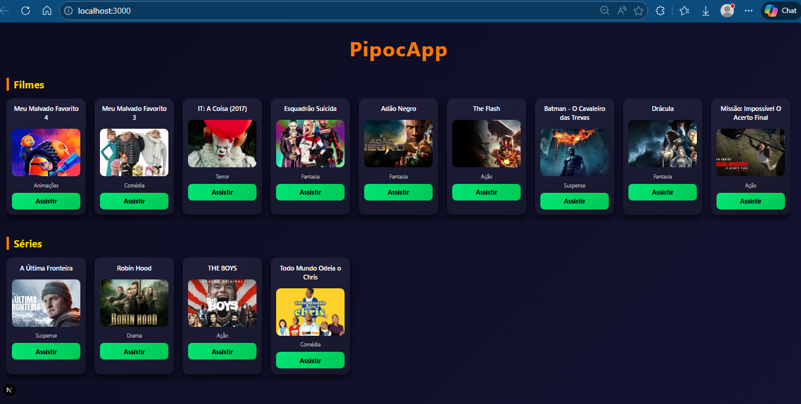

# PipocApp

O **PipocApp** é uma aplicação web desenvolvida para exibir filmes e séries de forma organizada, moderna e dinâmica, consumindo dados diretamente de um banco de dados PostgreSQL.

O projeto tem como objetivo principal praticar a integração entre **Front-End e Back-End**, utilizando tecnologias atuais do mercado.

---

## Ideia Principal

Criar uma plataforma simples e visual para listar **filmes e séries**, exibindo:

- Imagem
- Nome
- Tema
- Link externo para assistir

Os dados são carregados dinamicamente do banco de dados e renderizados no front-end.

---

## Funcionalidades

- Listagem de filmes
- Listagem de séries
- Exibição de imagens e descrições
- Botão “Assistir” com redirecionamento externo
- Layout responsivo com rolagem horizontal

---

## Tecnologias Utilizadas

### Linguagens

- JavaScript
- SQL
- CSS

### Frameworks e Bibliotecas

- Next.js
- React
- Node.js

### Banco de Dados

- PostgreSQL (Neon)

### Conexão com Banco

- Biblioteca `pg`

---

## Principais Telas

### Tela Inicial

- Título do projeto
- Seção de Filmes
- Seção de Séries
- Cards com imagem, nome, tema e botão “Assistir”

---

## 🧱 Estrutura do Projeto
